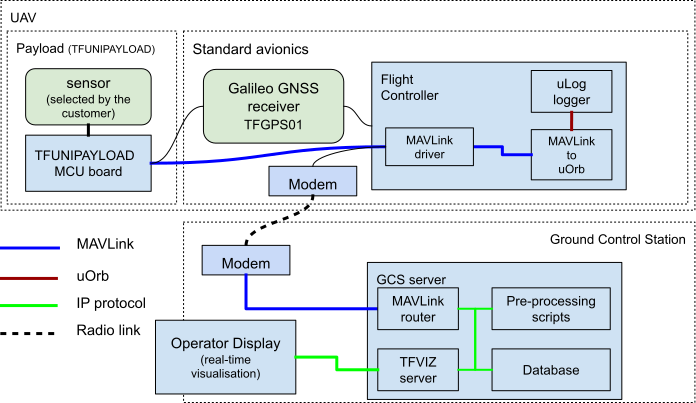

# TFUNIPAYLOAD - universal interface for atmospheric sensor payload 

Reference design of PX4 interface for generic [TF-ATMON](https://www.thunderfly.cz/tf-atmon.html) compatible payload detector. The purpose of this design is to connect a sensor to the [TF-ATMON](https://github.com/ThunderFly-aerospace/TF-ATMON) system despite the fact the sensor does not have any driver in flight stack (autopilot firmware) but at the same time, it is suitable for atmospheric measurement.



The sensor is connected to the [TFUNIPAYLOAD](https://github.com/ThunderFly-aerospace/TFUNIPAYLOAD01) board using a serial port. 
ATmega in TFUNIPAYLOAD01 runs the Arduino firmware, which prepares [MAVLink](https://en.wikipedia.org/wiki/MAVLink) messages to be logged and transported to GCS running TF-ATMON software. 

## Example of wiring

PX4 is capable of logging MAVLink data from the UART (Telemetry Port) port. [Pixhawk standard connector pinout](https://github.com/pixhawk/Pixhawk-Standards/blob/master/DS-009%20Pixhawk%20Connector%20Standard.pdf) is as follows:

| Pin        | Signal | Voltage levels  | Read/Write | Write |
| ---------- |:------:| ---------------:|------|------|
| 1 (red)    | Vcc | +5V | Optional | Optional |
| 2 (blk)    | TX (OUT)  |   +3.3 V | PX4 -> Payload | -- |
| 3 (blk)    | RX (IN)   |   +3.3 V | Payload -> PX4 | Payload -> PX4 |
| 4 (blk)    | CTS (IN)  |   +3.3 V | -- | -- |
| 5 (blk)    | RTS (OUT) |   +3.3 V | -- | -- |
| 6 (blk)    | GND       |   GND    | GND | GND |

For data to be received by PX4 autopilot, it must have a specific form. Explicitly, it needs to use a serial link with  [MAVLink v2](https://mavlink.io/en/) packets. In that case, the [Tunnel (#385)](https://mavlink.io/en/messages/common.html#TUNNEL) packets will be stored in autopilot's log file and forwarded to the GCS. 
The [TFUSBSERIAL01](https://github.com/ThunderFly-aerospace/TFUSBSERIAL01) hardware could be used to easily check for correct wiring. 

The following library [c_library_v2](https://github.com/mavlink/c_library_v2), which is automatically generated from message definition files, could be used. 

## Firmware examples

There are multiple Arduino-based firmware examples for different use cases. 

#### TFUNIPAYLOAD

[TFUNIPAYLOAD.ino](/SW/arduino/src/TFUNIPAYLOAD/TFUNIPAYLOAD.ino) contains a basic example, which listens to MAVLink messages from autopilot and sends tunnel packets with random data to the autopilot.

#### TFUNIPAYLOAD_MINIMAL

Since message parsing requires a lot of memory, we have prepared an example, where only [HEARTBEAT](https://mavlink.io/en/messages/common.html#HEARTBEAT) and [TUNNEL](https://mavlink.io/en/messages/common.html#TUNNEL) messages are sent. This example does not require a connected TX (from autopilot) and it is, therefore, suitable for MCUs with less memory.

Source code: [TFUNIPAYLOAD_MINIMAL.ino](/SW/arduino/src/TFUNIPAYLOAD_MINIMAL/TFUNIPAYLOAD_MINIMAL.ino)

#### Tunnel packet sending function

[Tunnel packet sending function](https://github.com/ThunderFly-aerospace/TFUNIPAYLOAD/blob/79eee22fe32725179d1df2b6ca72e901e2be1834/SW/arduino/src/TFUNIPAYLOAD/TFUNIPAYLOAD.ino#L50)

```  mav.SendTunnelData(data, sizeof(data), 0, 1, 0); ```
This function enables sending tunnel data to autopilot. It takes the following as its arguments:
 * data in uint8_t [127] format
 * data length
 * data type (every type of logged data will have its ID - it serves for easy differentiation of different sensors
 * target sysid
 * target compid

If the data only needs to be logged, the target sysid and compid must match the autopilot’s address, which is usually `sysid: 1, compid: 1`. If the data has to be logged and sent to GCS, broadcast must be set: `sysid: 1, compid: 0` or better `sysid: 0, compid: 0`. 

The autopilot only has a limited amount of storage memory (SD card) and it is therefore necessary to ensure, on the payload’s side, that it does not fill up during the flight. Alternatively, a maximum bandwidth on the MAVLink interface can be set in the autopilot. It is not tested what happens when the level set is exceeded[2021/09]. 

## Autopilot configuration

In the autopilot’s PX4 firmware, it is necessary to correctly set the following parameters (MAV_1_FORWARD and others will be visible only after setting the parameter MAV_1_CONFIG and rebooting the PX4): 

|     Parametr    | Value | Description |
|-----------------|-----------|------|
| [MAV_1_CONFIG](http://docs.px4.io/main/en/advanced_config/parameter_reference.html#mavlink)    | TELEM 2   | The port on which MAVLink packets will be expected. Any free, TELEM port, can be set |
| [MAV_1_FORWARD](http://docs.px4.io/main/en/advanced_config/parameter_reference.html#mavlink)   | **1**     | Enable message forwarding from this port|
| [MAV_1_RADIO_CTL](http://docs.px4.io/main/en/advanced_config/parameter_reference.html#mavlink) | **0**     | |
| [MAV_1_RATE](http://docs.px4.io/main/en/advanced_config/parameter_reference.html#mavlink)      | **0 B/s** | |
| [SER_TEL2_BAUD](http://docs.px4.io/main/en/advanced_config/parameter_reference.html#serial)   |     57600 | It is necessary to configure the port that is set in `MAV_1_CONFIG` parameter. The setting of the baud rate port. |

How to set the parameters in PX4 is described in [manual](http://docs.px4.io/master/en/advanced_config/parameters.html#changing-a-parameter).

## How to check, that the autopilot correctly receives MAVLink messages?

There are several options to find out whether the message sending is working correctly.

### Using the QGC

The message can be easily viewed live in [QGC](https://github.com/mavlink/qgroundcontrol/releases). For this procedure to function, two conditions must be fulfilled.

 1. The message must be broadcasted, meaning the message must have set its target sysid and compid to 0, 0.
 2. The computer must be connected via a MAVLink instance that supports message forwarding (e.g. via TELEM1 port using modem or UART-USB converter), autopilot's USB does not support it.

 > Warning, this procedure will not work if the autopilot is connected via a USB cable to the Pixhawk's USB port.

After opening QGC connect the autopilot to the computer (via RF modem or an external USB converter connected to the serial port). Once the autopilot is connected live data (such as autopilot attitude) will become visible. A subsequent click on the QGC logo in the top left corner will open a menu where you select `Analyze tools` and then open `MAVLink inspector` in order to see a list of all messages. 


The list of messages, when functioning correctly, should contain TUNNEL messages. 

### Using the MAVLink PX4 console

An advantage of connecting via [PX4 console](https://docs.px4.io/main/en/debug/consoles.html) lies in its independence on broadcasting setting and the possibility of checking whether the message is received and parsed by the autopilot. If the message is visible here (and the logging is enabled) it is at the same time already logged. With this procedure, a USB cable connection to the autopilot can be used. 

Autopilot console can be entered using the following python [script](https://github.com/ThunderFly-aerospace/PX4Firmware/blob/master/Tools/mavlink_shell.py) or using [QGC](https://github.com/mavlink/qgroundcontrol/releases).

 * In the case of using Python script it is enough to run the python3 script with a parameter of the chosen serial link to which the autopilot/modem is connected.
 * In the case of using QGC, the QGC must be opened in the autopilot console by clicking on the QGC logo (on the top), choosing `Analyze tools`, and choosing a console.

The received message can be then retrieved using the following command:

`listener mavlink_tunnel`

The command displays the current tunnel message. Adding the -n 100` parameter will cause a listing of 100 messages (and the new message will display by itself).

If the communication is working properly, the output should look like this:


### From an uLog file

The tunnel message can be logged into autopilot in a standard [uLog format](https://docs.px4.io/main/en/dev_log/ulog_file_format.html). However, because tools like [Flight review](https://review.px4.io/) are unable to display such data format, it is necessary to overcome this problem using a suitable tool. One option is using the [PlotJuggler](https://plotjuggler.io/). 
Another possibility for opening the log is the [jupiter notebook](https://github.com/ThunderFly-aerospace/TFUNIPAYLOAD/blob/master/SW/LogViewer/ReadTunnelData.ipynb).

## Known limitations

  * Avoiding overloading the autopilot's memory with messages must be ensured on the payload side
  * A maximum of 2 devices + modem or 3 devices without modem can be connected in this way. The limitation is caused by the Mavlink driver that is only able to connect a maximum of 3 instances of Mavlink devices and also due to a limited number of UART interfaces of the autopilot.
  * It is not possible for the input of payload messages and output to [sik modem](https://github.com/ThunderFly-aerospace/TFSIK01) to have the same type of MAVLink messages (stream) that would differ only in the number of messages per second. This means that it is not possible to simply select a data stream to be transmitted to the ground from the data stream intended for logging. If it is necessary to log more detailed data (with higher frequency) another MAVLink message must be logged.
